# time-series
## 捷運人流建模

* 原始檔(資料庫):https://drive.google.com/file/d/1hbEpwetpteGH6-z4ep89HPrlMISJOQuC/view?usp=sharing
* 資料清理(MS SQL)
* 資料概述(清理後) 
特定捷運站(北車/市府/南京復興/淡水/板橋)2020年4月份每日分時人流統計(進站/出站/總運量)

| 進站       | 0   | 1  | 5 | 6   | 7   | 8    | 9   | 10  | 11  | 12   | 13   | 14   | 15   | 16   | 17   | 18   | 19   | 20   | 21   | 22   | 23  | 總計 |
|----------|-----|----|---|-----|-----|------|-----|-----|-----|------|------|------|------|------|------|------|------|------|------|------|-----|-------|
| 2020/4/1 | 350 | 12 | 0 | 220 | 912 | 1638 | 937 | 657 | 747 | 1065 | 1221 | 1274 | 1263 | 1484 | 2953 | 7378 | 5162 | 2716 | 2308 | 1724 | 713 | 34734 |
| 2020/4/2 | 227 | 17 | 0 | 139 | 210 | 275  | 358 | 404 | 496 | 591  | 740  | 784  | 833  | 828  | 1069 | 1186 | 928  | 924  | 1021 | 870  | 387 | 12287 |
| 2020/4/3 | 169 | 10 | 0 | 118 | 191 | 219  | 322 | 401 | 442 | 490  | 674  | 770  | 646  | 802  | 1022 | 1002 | 851  | 772  | 865  | 801  | 378 | 10945 |
| 2020/4/4 | 194 | 9  | 0 | 90  | 156 | 170  | 277 | 314 | 386 | 478  | 487  | 599  | 591  | 675  | 862  | 864  | 753  | 687  | 793  | 709  | 336 | 9430  |
| 2020/4/5 | 107 | 2  | 0 | 92  | 172 | 183  | 283 | 344 | 351 | 470  | 558  | 691  | 672  | 707  | 892  | 794  | 713  | 699  | 720  | 549  | 253 | 9252  |
| 2020/4/6 | 165 | 5  | 0 | 204 | 926 | 1653 | 934 | 605 | 655 | 850  | 994  | 958  | 1129 | 1382 | 2827 | 7881 | 5708 | 2724 | 2031 | 1353 | 413 | 33397 |
| 2020/4/7 | 171 | 3  | 0 | 218 | 916 | 1748 | 996 | 610 | 611 | 903  | 1002 | 1058 | 1096 | 1288 | 2851 | 7697 | 5318 | 2668 | 2149 | 1406 | 528 | 33237 |
| 2020/4/8 | 213 | 4  | 1 | 212 | 968 | 1671 | 913 | 648 | 680 | 936  | 987  | 1093 | 1078 | 1231 | 3006 | 7573 | 5128 | 2637 | 2187 | 1509 | 540 | 33215 |

### 任務
對捷運人流進行資料視覺化及模型擬合預測

* step1 資料觀測 
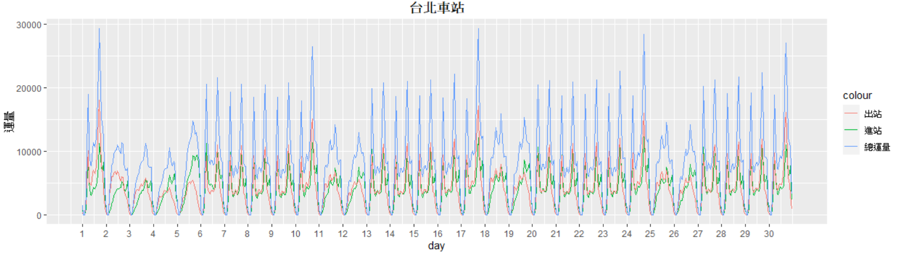
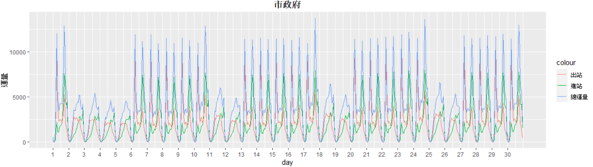
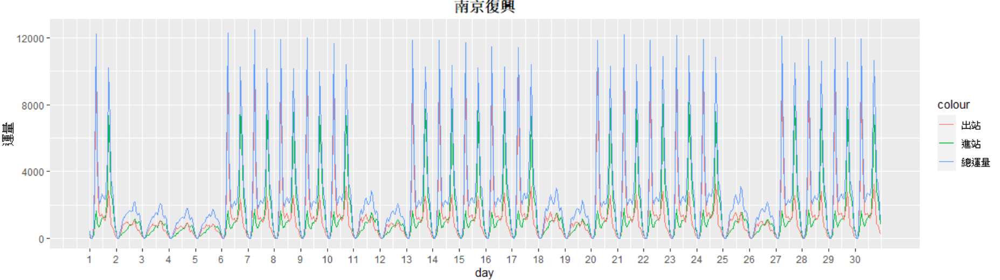
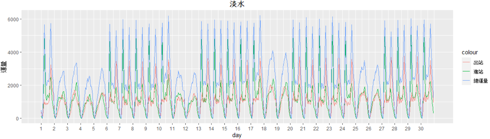
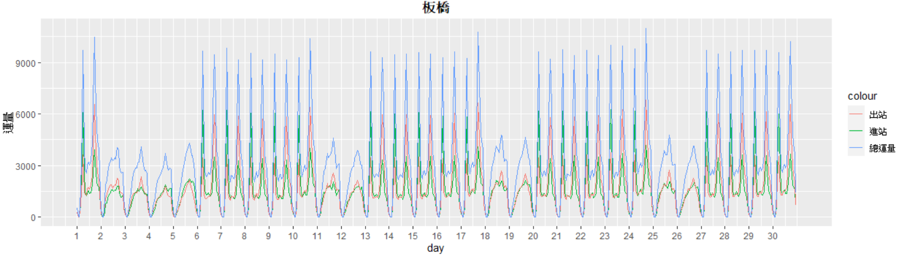

**初步觀測資料平穩且具週期性** 
**檢定平穩性:Augmented Dickey-Fuller Test**
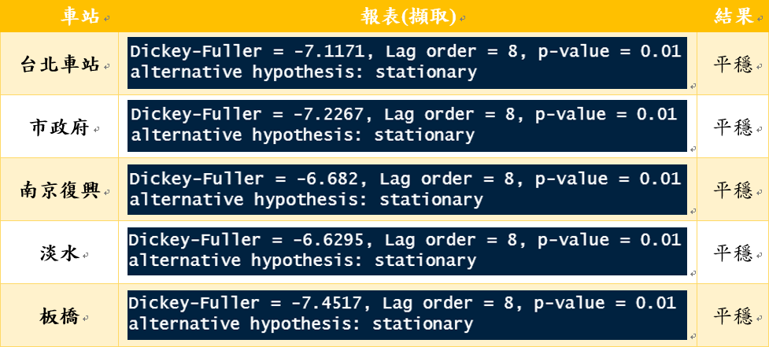

**資料平穩且具週期性，適用seasonal ARIMA**

* step2 資料擬合 
\ dx)
**台北車站 :   **  
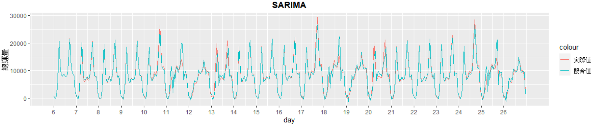
**市政府 : SARIMA(0,0,3)(0,1,0)21** 
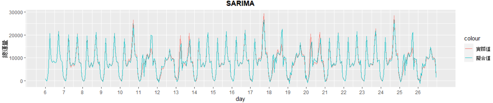
**南京復興 : SARIMA(1,0,1)(0,1,0)21** 
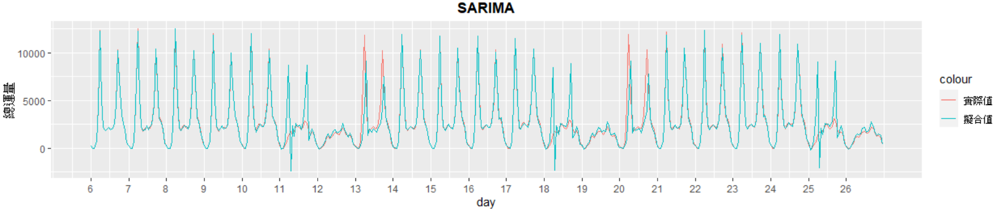
**淡水 : SARIMA(0,0,3)(0,0,1)21** 
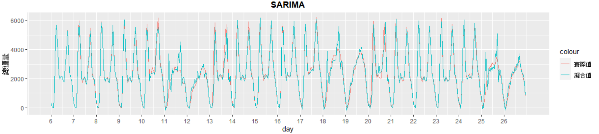
**板橋 : SARIMA(0,0,3)(0,1,0)21** 
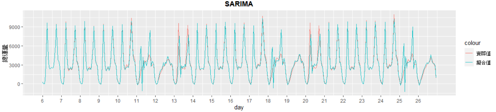

 

